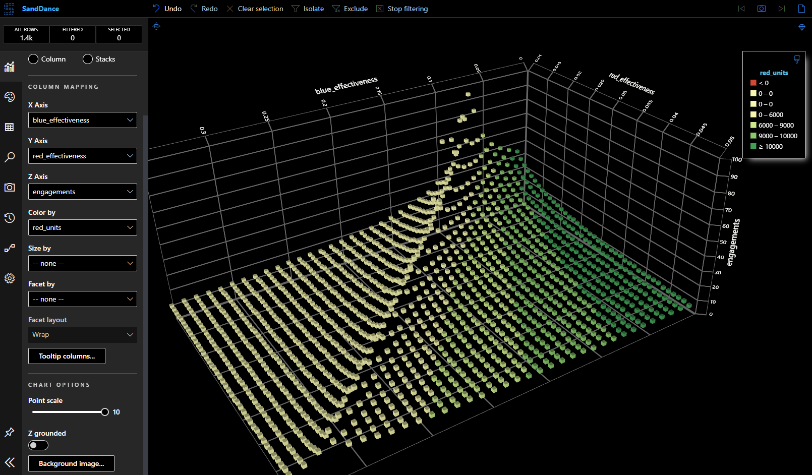

# Lancasim

## Simulate battle outcomes with Lancasim

Lancasim is a high-speed simulation environment. It can run many simulations of a battle using [Lanchester's square law](https://en.wikipedia.org/wiki/Lanchester%27s_laws). Results are written concurrently so that file operations do not influence the speed of the simulations. Use lancasim to find the attrition coefficient each team needs to beat the other, given the number of units both teams have.

### Prerequisites

- [Cargo](https://www.rust-lang.org/learn/get-started) if you want to compile from source.
- A CSV analysis tool like [SandDance for VSCode](https://marketplace.visualstudio.com/items?itemName=msrvida.vscode-sanddance)

### Usage

Lancasim is able to run many simulations of a battle, using the [Lanchester's square law](https://en.wikipedia.org/wiki/Lanchester%27s_laws). This is done based on a configuration file like this:

```ini
[Blue]
; integer: Start with this amount of units
units       = 100
; f32 between 0 and 1: Minimum attrition coefficient for this team
min_ac      = 0.1
; f32 between 0 and 1: Maximum attrition coefficient for this team
max_ac      = 0.2
; f32 between 0 and 1: Increment for each simulation
increment   = 0.01

[Red]
; integer: Start with this amount of units
units       = 100
; f32 between 0 and 1: Minimum attrition coefficient for this team
min_ac      = 0.01
; f32 between 0 and 1: Maximum attrition coefficient for this team
max_ac      = 0.05
; f32 between 0 and 1: Increment for each simulation
increment   = 0.001
```

The simulation environment will run a simulation for all points on a `blue` by `red` matrix, where the attrition coefficients for each team increases incrementally. It will then concurrently write the results to a file in the `results` directory.

**Running simulations**

Starting lancasim with the `--help` option will show the following:

```
         _       ___   _   _ _____   ___   _____ ________  ___
        | |     / _ \ | \ | /  __ \ / _ \ /  ___|_   _|  \/  |
        | |    / /_\ \|  \| | /  \// /_\ \\ `--.  | | | .  . |
        | |    |  _  || . ` | |    |  _  | `--. \ | | | |\/| |
        | |____| | | || |\  | \__/\| | | |/\__/ /_| |_| |  | |
        \_____/\_| |_/\_| \_/\____/\_| |_/\____/ \___/\_|  |_/


        Simulate battle results with Lancaster simulation.

Usage: lancasim [OPTIONS] <file>

Arguments:
  <file>  Path to the .ini file. Example: ./path/to/file.ini

Options:
  -f, --full-results  Output full battle diagnostics for each engagement. BEWARE: This is computationally expensive.
  -h, --help          Print help
  -V, --version       Print version
```

After running the simulations, lancasim creates a `results` directory inside the current working directory. Inside the results directory it creates a directory with the name of the simulation (i.e. name of the `.ini` file). It also creates a `.csv` file with the same name. If the `-f` or `--full-results` option is specified, lancasim outputs the battle diagnostics for each engagement for each simulation. This can be computationally very expensive and is disabled by default.

**Results analysis**

Now open the results file in a tool like [SandDance for VSCode](https://marketplace.visualstudio.com/items?itemName=msrvida.vscode-sanddance) to analyse the results.



On the X and Y axes, plot the effectiveness of each team. On the Z axis, plot the number of engagements for that particular simulation. Use color to select the number of units left of the team you want to analyse. In this example both side can potentially win. There is a steep cut-off line, where blue must have a really high effectiveness to beat red's relatively low effectiveness.